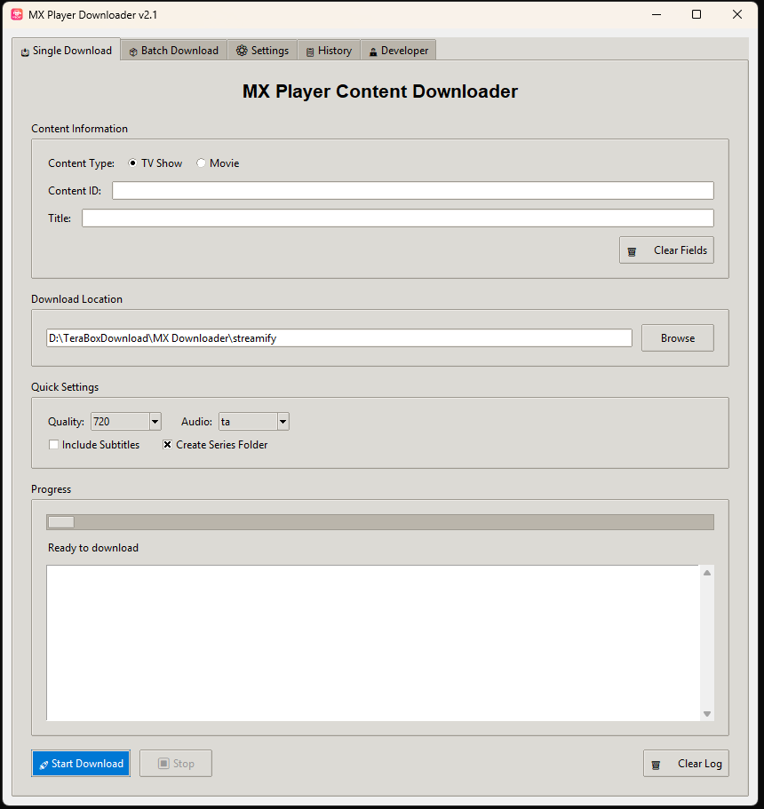
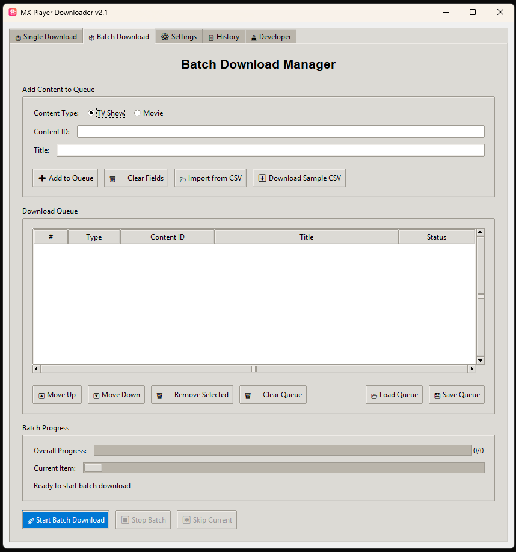
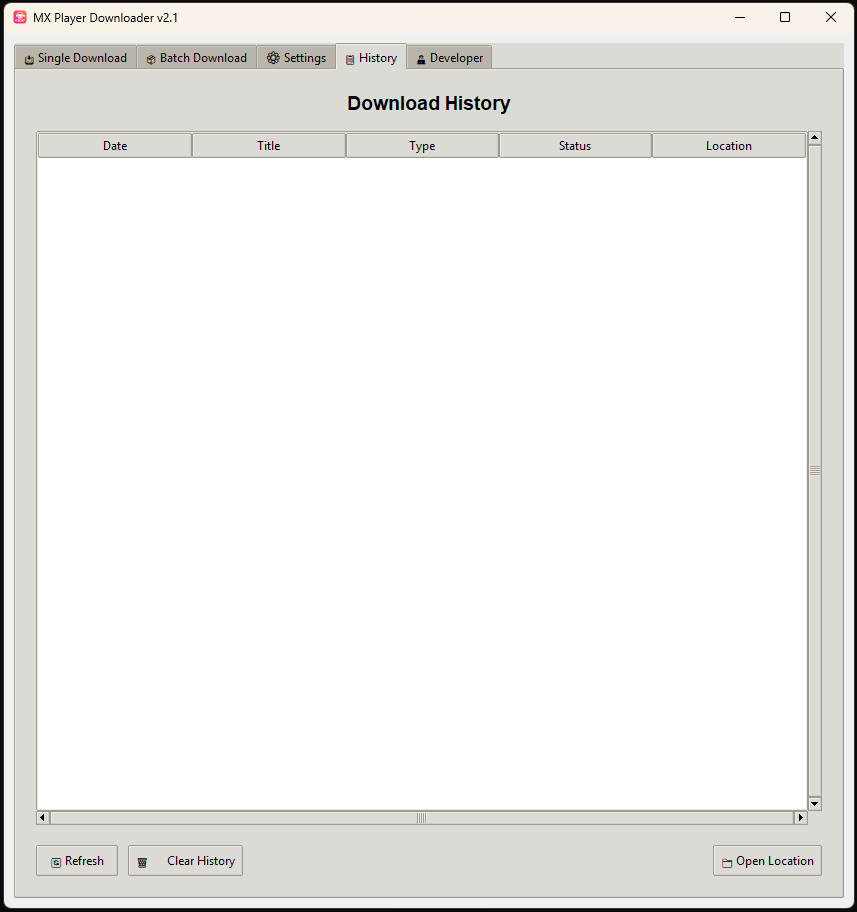
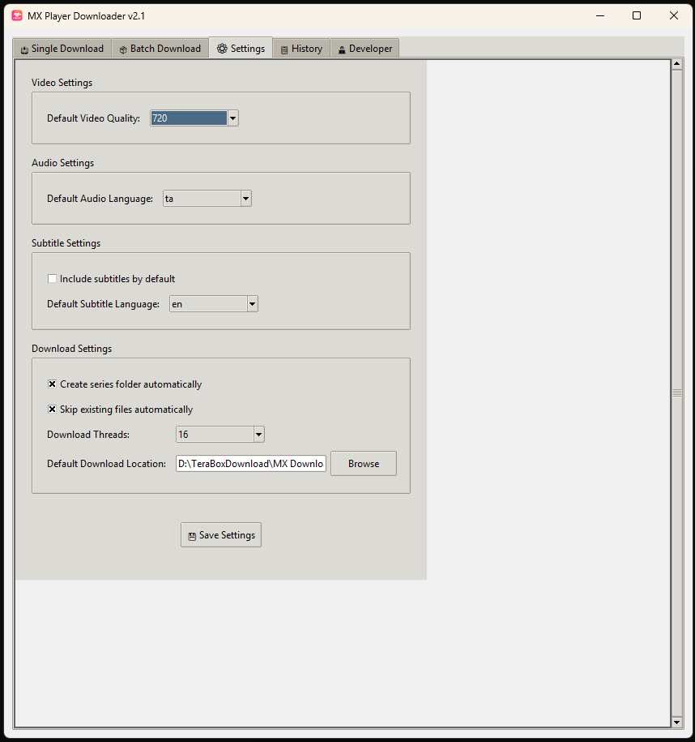

# 📺 MX Player Downloader GUI v2.1

A powerful and user-friendly **GUI tool** to download TV Shows and Movies from **MX Player** in multiple qualities, languages, and with optional subtitles.  
Built with **Python**, **Tkinter**, **yt-dlp**, and **FFmpeg**.

---

## 📷 Screenshots

### 🎯 Main Interface - Single Download


### 📂 Batch Download Tab


### 🗂 Download History


### ⛏️ Settings


---

## ✨ Features

- **Single Download Mode**
  - Download TV Shows or Movies by content ID
  - Choose video quality (480p to 4K)
  - Select audio language
  - Include optional subtitles
  - Auto-create series folders
  - Skip already downloaded files

- **Batch Download Mode**
  - Add multiple shows/movies to a queue
  - CSV import for bulk downloads
  - Move, remove, and reorder queue items
  - Save and load download queues
  - Resume incomplete batch downloads

- **Progress & Logging**
  - Real-time progress bar
  - Detailed log output
  - Status updates for current and overall batch progress

- **History Tracking**
  - Keep a history of all downloads
  - Reopen download folders directly from history
  - Clear history when needed

- **Customizable Settings**
  - Default video/audio/subtitle preferences
  - Download location
  - Number of download threads
  - Auto-skip existing files

- **Developer Info Tab**
  - Version details
  - GitHub profile and repository links
  - Feature list
  - Contribution and issue reporting links

---

## 📂 Requirements

### **Python**
- Python 3.7 or higher

### **Dependencies**
Install Python dependencies:
```bash
pip install requests yt-dlp
```

### **External Tools**
- **yt-dlp** (for downloading video/audio streams)
  - Install via:
    ```bash
    pip install yt-dlp
    ```
- **FFmpeg** (for merging video/audio/subtitles)
  - Download from: [https://ffmpeg.org/download.html](https://ffmpeg.org/download.html)  
  - Make sure `ffmpeg` is available in your system PATH

---

## 🚀 How to Run

1. Clone or download this repository.
2. Ensure Python, `yt-dlp`, and `ffmpeg` are installed.
3. Run the script:
   ```bash
   python enhanced_mxplayer_gui.py
   ```
4. Enjoy downloading MX Player content with a GUI!

---

## 📄 Usage

- **Single Download**
  1. Select "TV Show" or "Movie"
  2. Enter the **Content ID** and **Title**
  3. Set video/audio/subtitle preferences
  4. Click **🚀 Start Download**

- **Batch Download**
  1. Add items manually or import from a CSV
  2. Reorder or remove items if needed
  3. Click **🚀 Start Batch Download**

- **History**
  - View all past downloads
  - Open saved files directly
  - Clear history if desired

---

## 💡 Future Development Ideas

- [ ] **Auto Content ID Fetcher**  
  Fetch content ID automatically from MX Player URLs.
- [ ] **Thumbnail & Metadata Preview**  
  Show content posters, descriptions, and runtime before downloading.
- [ ] **Parallel Batch Downloads**  
  Download multiple queue items simultaneously for faster completion.
- [ ] **In-App Video Player**  
  Preview downloaded content directly inside the app.
- [ ] **Cross-Platform Packaging**  
  Provide standalone `.exe` and `.app` builds without Python installation.
- [ ] **Advanced Search & Filter in History**  
  Search by date, title, or status.

---

## 👨‍💻 Developer

**Author:** PurushothMathav  
**GitHub:** [https://github.com/PurushothMathav](https://github.com/PurushothMathav)

If you find this tool useful:
- ⭐ Star the repo on GitHub
- 🐛 Report issues
- 💡 Suggest new features

---

**⚠ Disclaimer:**  
This tool is for educational purposes only. Downloading copyrighted content without permission may violate laws in your country. Use at your own risk.
